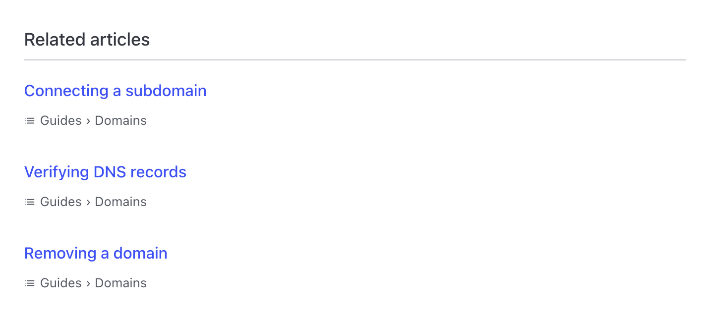

<div align="center">

# starlight-related-articles

**Related articles for your [Starlight](https://starlight.astro.build/) docs, ranked by what the pages actually say.**

No tagging discipline. No embeddings API. No external service. No client-side JavaScript.

[](https://www.npmjs.com/package/starlight-related-articles)
[](https://www.npmjs.com/package/starlight-related-articles)
[](https://github.com/yshmarov/starlight-related-articles/actions/workflows/ci.yml)
[](https://starlight.astro.build/)
[](./LICENSE)

<picture>
  <source media="(prefers-color-scheme: dark)" srcset="./.github/assets/related-dark.png">
  
</picture>

</div>

## Install

```sh
npm install starlight-related-articles
```

```js
// astro.config.mjs
import { defineConfig } from 'astro/config';
import starlight from '@astrojs/starlight';
import starlightRelatedArticles from 'starlight-related-articles';

export default defineConfig({
  integrations: [
    starlight({
      title: 'My Docs',
      plugins: [starlightRelatedArticles()],
    }),
  ],
});
```

That's the whole setup. Every article now ends with a related-articles section.

## Why not tags?

Tag overlap is the usual way to do this, and on real documentation it under-performs badly.

In the corpus this plugin was extracted from — a ~600-article product help centre — pages carried a median of **2 tags**, and **~24% had none at all**. Tag ranking therefore misses pairs any reader would call related: a *Site Pages* article and a *Site Settings* article share no tag but are plainly neighbours. Worse, the untagged quarter of the site gets no suggestions whatsoever.

Ranking the **text** fixes both. This plugin builds TF-IDF vectors over your pages — sublinear term frequency, inverse document frequency, L2-normalized — and ranks neighbours by cosine similarity. Titles are weighted up, because a title term says far more about a page than a body term.

IDF handles the rest for free. A term's weight is `log(N / pagesContainingIt)`, so a word appearing on *every* page of your site — your product name, "settings", "click" — is driven to **exactly zero**. That is why there is no domain stopword list to maintain: your corpus suppresses its own boilerplate.

One O(n²) pass at build time, memoized for the build. On ~1,200 pages it costs a couple of seconds and ships no client-side JavaScript.

## What gets excluded

A page is kept out of the index — neither given suggestions nor offered as one — when it is:

- `draft: true`
- `sidebar: { hidden: true }` — category landing pages, unlisted or soft-beta content
- `template: splash` — your homepage
- matched by an `exclude` glob
- empty

That is usually what you want on day one: landing pages shouldn't recommend, and unlisted pages shouldn't be recommended.

## Configuration

Every option is optional.

```js
starlightRelatedArticles({
  count: 6,
  titleWeight: 3,
  sourceLocale: 'root',
  exclude: ['reference/api/**'],
  trailSeparator: '›',
})
```

| Option | Type | Default | What it does |
| --- | --- | --- | --- |
| `count` | `number` | `6` | How many suggestions to render. |
| `neighbors` | `number` | `12` | How many to keep per page in the index. Headroom above `count` so title de-duplication still has candidates. |
| `titleWeight` | `number` | `3` | How many times a page's title is repeated into its term stream. |
| `minTermLength` | `number` | `3` | Terms shorter than this are ignored. |
| `stopWords` | `string[]` | ~50 structural English words | Words dropped before scoring. IDF already handles domain-ubiquitous terms. |
| `minScore` | `number` | `0` | Drop neighbours at or below this cosine similarity. |
| `dedupeByTitle` | `boolean` | `true` | Collapse same-titled pages to one suggestion (content cross-filed under several slugs). |
| `sourceLocale` | `string` | — | Rank one locale's corpus and share the result across translations. [See below](#multilingual-sites-sourcelocale). |
| `fallback` | `'siblings' \| 'none'` | `'siblings'` | What to show for a page the index can't rank. [See below](#fallback-pages-the-index-cant-rank). |
| `exclude` | `string[]` | `[]` | Page-ID globs to keep out of the index. `*` matches within a segment, `**` across segments. |
| `showTrail` | `boolean` | `true` | Show each suggestion's sidebar group trail beneath its title. |
| `trailSeparator` | `string` | `'›'` | Separator between group-trail levels. |
| `trailIcon` | `StarlightIcon \| false` | `'list-format'` | Icon before the trail. Any [built-in Starlight icon](https://starlight.astro.build/reference/icons/), or `false`. |
| `injectComponent` | `boolean` | `true` | Render automatically. Set `false` to [place the component yourself](#placing-the-section-yourself). |

> **Small sites:** with fewer than ~30 pages there often aren't six genuinely related articles to show, and the tail fills with weak matches. Lower `count`, or raise `minScore` until only real neighbours survive.

### Multilingual sites: `sourceLocale`

Related articles are a property of the **article**, not of the language you happen to be reading it in. And whitespace tokenization — which is what TF-IDF does — is meaningless for Japanese, Chinese, or Thai, so ranking those corpora directly yields noise.

`sourceLocale` solves both at once: rank one locale's corpus, then resolve each neighbour to whichever translation the reader is on.

```js
starlightRelatedArticles({ sourceLocale: 'root' }) // or 'en', 'de', …
```

Suggestions are titled in the reader's language where a translation exists, and their URLs are always localized.

Pages using Starlight's **fallback content** — a locale where the translation is missing, so the default-locale text is served at the localized URL — are ranked as the entry that supplies their text, and their suggestions are localized to the URL the reader is on. Partial translations need no special handling.

Leave `sourceLocale` unset to rank each locale's corpus independently.

### `fallback`: pages the index can't rank

One case has no similarity data by construction: a page that exists *only* outside `sourceLocale`, so it has no counterpart in the ranked corpus. By default those pages fall back to their siblings — the other pages in their **sidebar group**, or, when the sidebar doesn't contain them at all, the pages **filed in the same directory**. (A multilingual sidebar is typically built from one locale's tree, so a page unique to another locale can be absent from it.) Weaker than content similarity, but relevant, and better than an empty section.

Set `fallback: 'none'` to render nothing instead. Pages *excluded* from the index always render nothing, whatever `fallback` says.

### Styling

The markup is flat and every value is a CSS custom property. Styles live in a `starlight.related` cascade layer, so any unlayered rule in your own stylesheet wins without `!important`.

```html
<nav class="sl-related">
  <h2 class="sl-related__heading">Related articles</h2>
  <ul class="sl-related__list">
    <li class="sl-related__item">
      <a class="sl-related__link" href="…">Title</a>
      <span class="sl-related__trail">
        <svg class="sl-related__trail-icon" />Guides › Domains
      </span>
    </li>
  </ul>
</nav>
```

```css
.sl-related {
  --sl-related-margin: 4rem;
  --sl-related-gap: 1rem;
  --sl-related-heading-size: 1.25rem;
  --sl-related-link-size: 1rem;
  --sl-related-trail-size: 0.8125rem;
  --sl-related-rule: 2px solid var(--sl-color-accent);
}
```

For a custom trail glyph, set `trailIcon: false` and draw your own:

```css
.sl-related__trail::before {
  content: '';
  width: 0.9em;
  height: 0.9em;
  background: currentColor;
  mask: url('/icons/folder.svg') center / contain no-repeat;
}
```

### Translating the heading

The heading uses Starlight's i18n system under the key `relatedArticles.title`. 27 languages ship with the plugin; override or add one from your own `i18n` collection:

```json
// src/content/i18n/de.json
{ "relatedArticles.title": "Weiterführende Artikel" }
```

## Placing the section yourself

By default the plugin overrides Starlight's `Pagination` component, because it is the one component Starlight renders unconditionally at the bottom of an article's content. **An existing `Pagination` override of yours is preserved and rendered first** — the plugin wraps it rather than replacing it, so you keep your own prev/next design.

To take full control, turn the injection off and render the component wherever you like:

```js
starlightRelatedArticles({ injectComponent: false })
```

```astro
---
// src/components/Footer.astro
import Default from '@astrojs/starlight/components/Footer.astro';
import RelatedArticles from 'starlight-related-articles/components/RelatedArticles.astro';
---

<Default />
<RelatedArticles />
```

## Using the data directly

The ranking is attached to Starlight's route data by route middleware, so you can skip the component entirely and build your own UI — cards, a sidebar rail, a JSON endpoint:

```astro
---
import { getRelatedArticles } from 'starlight-related-articles/route-data';

const related = getRelatedArticles(Astro.locals);
// → [{ id: 'guides/example', title: 'Example', href: '/guides/example/' }, …]
---
```

`href` honours your `base`, `trailingSlash` and `build.format` settings.

## How it works

| Piece | Role |
| --- | --- |
| `libs/similarity.ts` | TF-IDF vectors + cosine ranking. Pure functions, no Astro dependency. |
| `libs/index-builder.ts` | Reads the `docs` collection, filters it, ranks it once per build. |
| `libs/resolve.ts` | Picks the current page's neighbours and localizes them. |
| `libs/href.ts` | Derives URLs from the current route, with no config plumbing. |
| `libs/trail.ts` | Group trail, from the sidebar Starlight already built. |
| `libs/siblings.ts` | Sidebar-group and same-directory fallbacks. |
| `middleware.ts` | Attaches the result to `Astro.locals.starlightRoute`. |
| `components/RelatedArticles.astro` | Presentation only. |

There is no build step to remember and no generated file to commit: the index is computed inside the Astro build, from the content collection, using whichever loader you already use.

## Development

```sh
npm install
npm test          # unit tests via node:test — no test framework to install
npm run typecheck

cd demo && npm install && npm run dev   # a small Starlight site using the plugin
```

The ranking logic is pure and covered directly: title weighting, IDF suppression, tie-break determinism, code-fence handling, de-duplication, locale mapping, URL construction under every `base` / `trailingSlash` / `build.format` combination, and both sibling fallbacks.

## Compatibility

- Starlight `>=0.32.0`
- Astro `>=5.5.0`
- Node `>=20.3.0`

## License

MIT
